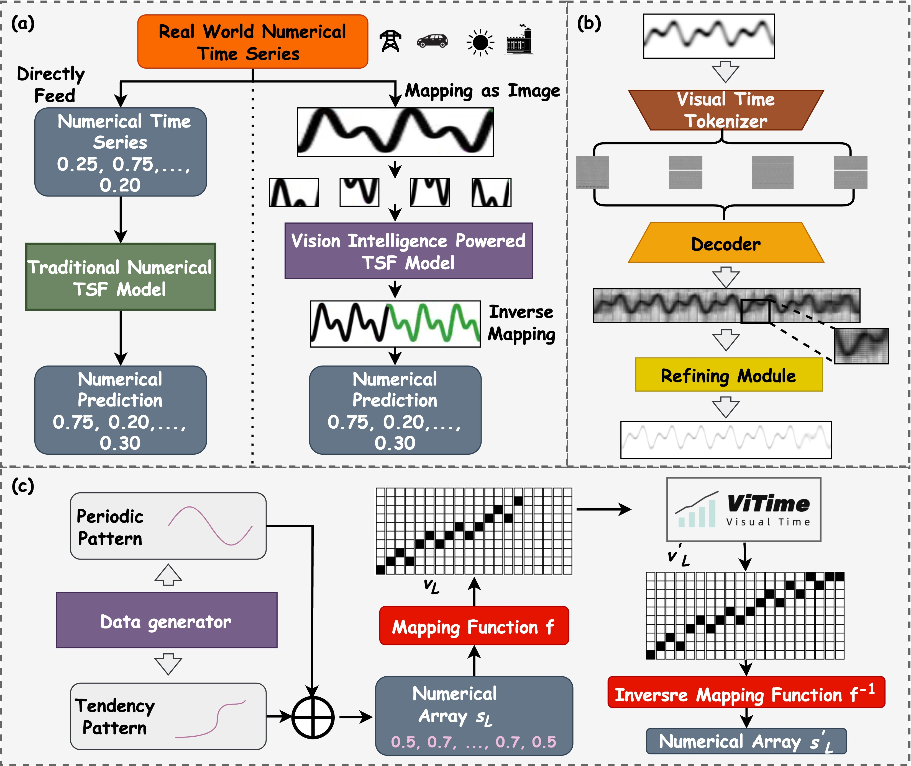
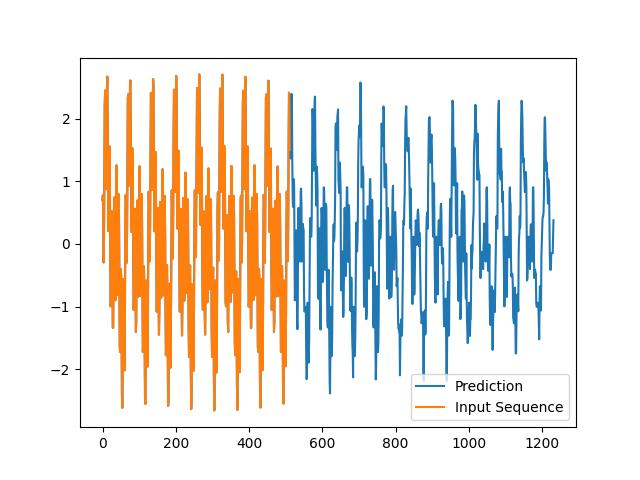

# ViTime: A Vision Intelligence-Powered Foundation Model for Time Series Forecasting

**[Paper](https://openreview.net/forum?id=XInsJDBIkp) | [Code](https://github.com/IkeYang/ViTime)**

This is the official repository for the paper: **"ViTime: Foundation Model for Time Series Forecasting Powered by Vision Intelligence"**, published in Transactions on Machine Learning Research (TMLR), 10/2025.

ViTime is a pioneering foundation model for Time Series Forecasting (TSF) that fundamentally shifts the paradigm from traditional numerical fitting to a novel approach powered by vision intelligence. Instead of operating directly on numerical sequences, ViTime transforms time series into binary images, leveraging a formally defined metric space to perform forecasting tasks. This vision-based paradigm enhances robustness, generalizability, and performance, especially in zero-shot and few-shot scenarios.

## 🌟 Key Contributions

- **Novel Theoretical Framework**: We introduce ViTime, a TSF foundation model grounded in a novel theoretical framework that shifts from conventional numerical fitting to operations within a formally defined binary image-based time series metric space.

- **Advanced Data Synthesis (RealTS)**: To train a truly generalizable model, we developed RealTS, a sophisticated data generation algorithm that synthesizes diverse and realistic time series by modeling fundamental "trend" and "periodicity" components. This mitigates the risk of test-set leakage inherent in models trained on large real-world corpora.

- **State-of-the-Art Performance**: ViTime sets a new SOTA in zero-shot, few-shot, and robust forecasting. It significantly outperforms existing foundation models like TimesFM and supervised benchmarks, particularly under data perturbations and missing value scenarios.

- **Point and Probabilistic Forecasting**: The ViTime framework naturally supports both point and probabilistic forecasting by generating a probability distribution over the value-axis for each time step.

## 🏛️ Architecture Overview

The ViTime framework comprises four key modules:
1.  **RealTS Synthesis**: Generates diverse synthetic training data to ensure the model learns universal time series patterns.
2.  **Mapping Function**: Converts numerical time series into high-resolution binary images, transforming temporal correlations into spatial patterns.
3.  **ViTime Model**: A Vision Transformer (ViT) based network that learns patterns from the binary image representation. It includes a Visual Time Tokenizer, a Decoder, and a Refining Module to ensure prediction continuity.
4.  **Inverse Mapping**: Converts the predicted binary image back into a numerical time series forecast.

The complete architecture is illustrated below:


> **Figure 1**: ViTime architecture overview. (a) Pipeline comparison. (b) ViTime network modules. (c) Complete architecture.

## 📊 Zero-Shot Performance

ViTime demonstrates exceptional zero-shot generalization. To ensure a fair and rigorous comparison, we introduced scale-invariant metrics (ReMAE and ReMSE), which rescale the test set to mitigate potential test set leakage from training on large, comprehensive real-world datasets.

The table below (Table 2b from the paper) summarizes the zero-shot point forecasting performance against other leading foundation models. ViTime achieves state-of-the-art results on 11 out of 14 evaluation settings, highlighting its robust generalization across different temporal resolutions.

| Model | ETTh1 | ETTh2 | ETTm1 | ETTm2 | electricity | traffic | weather |
| :--- | :---: | :---: | :---: | :---: | :---: | :---: | :---: |
| | **ReMSE** / **ReMAE** | **ReMSE** / **ReMAE** | **ReMSE** / **ReMAE** | **ReMSE** / **ReMAE** | **ReMSE** / **ReMAE** | **ReMSE** / **ReMAE** | **ReMSE** / **ReMAE** |
| **Numerical Models** | | | | | | | |
| Moriai | 1.144 / 0.722 | 0.754 / 0.467 | 1.448 / 0.849 | 0.455 / 0.397 | 0.859 / 0.676 | 1.416 / 0.894 | 0.706 / 0.414 |
| Moment | 1.089 / 1.240 | 0.498 / 0.321 | 0.894 / 0.618 | 0.542 / 0.582 | 0.907 / 0.743 | 1.138 / 0.690 | 0.545 / 0.349 |
| VisionTS | 0.988 / 1.016 | 0.524 / 0.350 | 0.873 / 0.559 | 0.773 / 0.516 | 0.851 / 0.669 | 1.173 / 0.669 | 0.519 / 0.327 |
| TimesFM | 0.490 / 0.467 | 0.374 / 0.396 | 0.671 / 0.503 | 0.355 / 0.359 | 0.367 / 0.404 | 0.744 / 0.519 | 0.284 / 0.306 |
| PatchTST-ZS | 1.477 / 0.903 | 1.097 / 0.775 | 1.295 / 0.798 | 0.805 / 0.613 | 1.414 / 0.921 | 2.054 / 1.002 | 0.911 / 0.584 |
| **Vision-Assisted Models** | | | | | | | |
| ViTime-TFM | 0.481 / 0.451 | 0.314 / 0.354 | 0.519 / 0.455 | 0.276 / 0.325 | 0.301 / 0.350 | 0.718 / 0.460 | 0.237 / 0.261 |
| **ViTime (Ours)** | **0.457** / **0.431** | **0.290** / **0.346** | **0.473** / **0.420** | **0.237** / **0.301** | **0.225** / **0.308** | **0.730** / **0.400** | **0.203** / **0.228** |

## 🚀 Getting Started

### 1. Installation

First, clone the repository and navigate to the project directory:
```bash
git clone https://github.com/IkeYang/ViTime.git
cd ViTime
```

Next, install the required dependencies. We recommend using a virtual environment.
```bash
pip install -r requirements.txt
```

### 2. Download Pre-trained Model

Download our pre-trained model weights from the link below and place them in the appropriate directory.

- **Model**: `ViTime_Model.pth`
- **Download Link**: [Google Drive](https://drive.google.com/file/d/1ex5ZrIKhsnLj2EuUkP9We3Bpcr1kVh5d/view?usp=sharing)

After downloading, please ensure the path to the model is correctly specified in your configuration file (`config.py`).

## 💻 Inference

We provide a simple and efficient `ViTimePrediction` class for running inference. The following example demonstrates how to generate a forecast for a given historical sequence.

```python
import numpy as np
import matplotlib.pyplot as plt
from main import ViTimePrediction

# 1. Prepare your historical data as a NumPy array
# This example uses a synthetic time series
xData = np.sin(np.arange(512) / 10) + np.sin(np.arange(512) / 5 + 50) + np.cos(np.arange(512) + 50)

# 2. Define the length of the future you want to predict
prediction_length = 720

# 3. Initialize the predictor
# Use 'cuda:0' for GPU or 'cpu' for CPU
# lookbackRatio=None uses the full historical data provided
vitime = ViTimePrediction(device='cuda:0', model_name='MAE', lookbackRatio=None)

# 4. Generate the prediction
prediction = vitime.prediction(xData, prediction_length)

# 5. Visualize the results
plt.figure(figsize=(12, 6))
plt.plot(np.concatenate([xData, prediction.flatten()], axis=0), label='Prediction')
plt.plot(xData, label='Input Sequence')
plt.title("ViTime Forecast")
plt.xlabel("Time")
plt.ylabel("Value")
plt.legend()
plt.show()
```

The script will produce a plot showing the input sequence and the model's forecast.


> **Figure**: Example forecast generated by ViTime.

## 📜 Citation

If you find our work useful in your research, please consider citing our paper:
```bibtex
@article{yang2025vitime,
  title={{ViTime}: Foundation Model for Time Series Forecasting Powered by Vision Intelligence},
  author={Yang, Luoxiao and Wang, Yun and Fan, Xinqi and Cohen, Israel and Chen, Jingdong and Zhang, Zijun},
  journal={Transactions on Machine Learning Research},
  year={2025},
  url={https://openreview.net/forum?id=XInsJDBIkp},
  note={Published in Transactions on Machine Learning Research (10/2025)}
}
```
