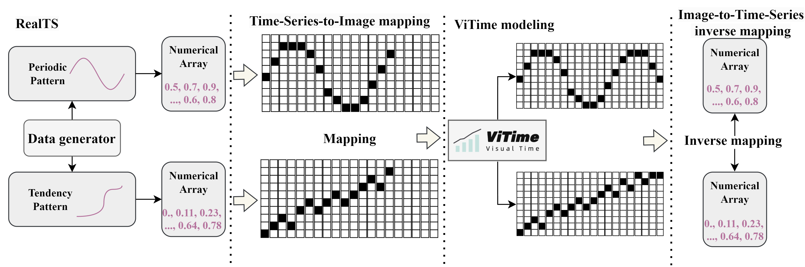

# ViTime: A Visual Intelligence-based Foundation Model for Time Series Forecasting



ViTime is a novel Visual Intelligence-based foundation model for time series forecasting (TSF), leveraging visual data processing paradigms to enhance forecasting capabilities.

## Key Features

- **Visual Intelligence**: Utilizes visual data processing to enhance time series analysis and forecasting.
- **Real Time Series (RealTS)**: A novel data synthesis method improving model training and performance.
- **Zero-Shot Performance**: Achieves state-of-the-art zero-shot forecasting on diverse datasets, often surpassing the best supervised models.

## Getting Started

### Prerequisites

- Python 3.7+
- PyTorch
- NumPy
- Matplotlib

### Installation

Clone the repository:

```bash
git clone https://github.com/IkeYang/ViTime.git
cd ViTime
```

Install the required packages:

```bash
pip install -r requirements.txt
```

### Model Inference

To run the inference code, follow these steps:

1. **Load the Pretrained Model**: Ensure you have the pretrained model file `ViTime_V2_Opensource.pth`.

2. **Prepare the Inference Script**:

```python
import matplotlib.pyplot as plt
from model.model import ViTime
import numpy as np
import torch

deviceNum = 0
torch.cuda.set_device(deviceNum)
device = torch.device('cuda' if torch.cuda.is_available() else 'cpu')
checkpoint = torch.load(r'C:\Users\user\Downloads\ViTime_V2_Opensource.pth', map_location=device)
args = checkpoint['args']
args.device = device
args.flag = 'test'

# Set upscaling parameters
args.upscal = True  # True: max input length = 512, max prediction length = 720
                    # False: max input length = 1024, max prediction length = 1440
model = ViTime(args=args)
model.load_state_dict(checkpoint['model'])
model.to(device)
model.eval()

# Example data
xData = np.sin(np.arange(512) / 10)
args.realInputLength = len(xData)
yp = model.inference(xData)

# Plot results
plt.plot(np.concatenate([xData, yp.flatten()], axis=0))
plt.plot(xData)
plt.show()
```

3. **Run the Inference**:

```bash
python inference.py
```

This script loads the ViTime model, performs inference on example sinusoidal data, and plots the predicted sequence alongside the input sequence.

## Experiments and Results

ViTime has been evaluated on a diverse set of previously unseen forecasting datasets, demonstrating state-of-the-art zero-shot performance. The model often surpasses the best individually trained supervised models, showcasing the potential of visual intelligence in time series forecasting.

## Contributing

We welcome contributions to enhance ViTime. Please submit pull requests or open issues for any improvements or bug fixes.

## License

This project is licensed under the MIT License.

## Acknowledgments

We thank the contributors and the community for their support and valuable feedback.

---

For more details, please refer to our paper and documentation. Feel free to reach out with any questions or suggestions.

---

*This README was generated based on the model's abstract and inference script provided.*
```
